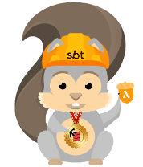

# sam-dynamodb-seed.g8
A template project for quickly creating stateful serverless applications using dynamodb.

## Introduction
The seed shows how to:

- setup a dynamodb table
- how to handle get and post requests
- how to save and load using dynamodb tables

## Usage
Create a new template project by typing:

```
sbt new dnvriend/sam-dynamodb-seed.g8
```

## Deploying
To deploy, you need to have your AWS account setup correctly:

- To deploy type: `samDeploy`,
- To remove type: `samRemove`,
- To get more info type: `samInfo`,
- To view the CloudFormation template type: `samValidate`.

For more information, please see the [dnvriend/sbt-sam](https://github.com/dnvriend/sbt-sam) repository.